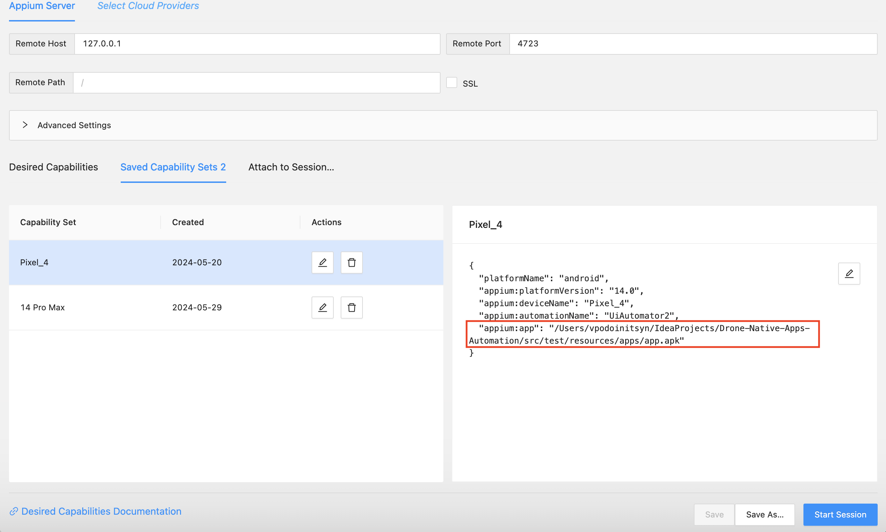
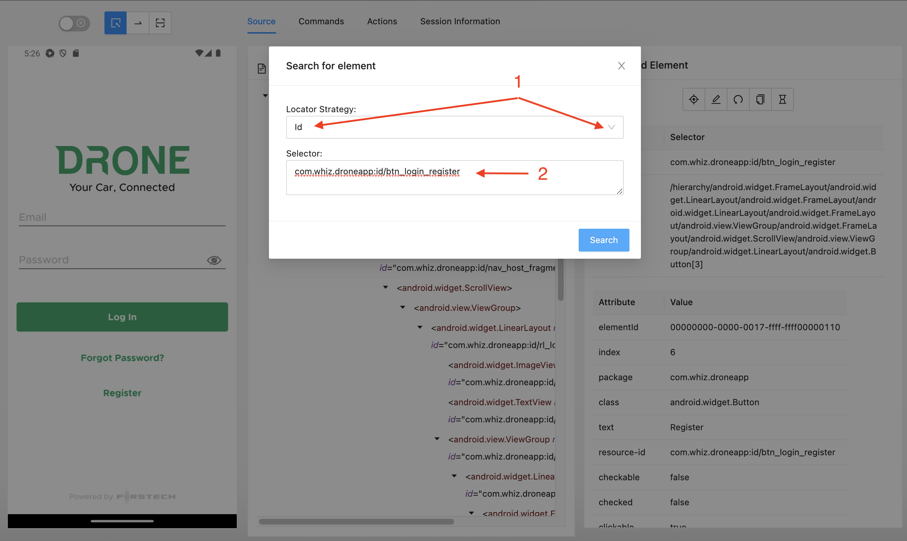
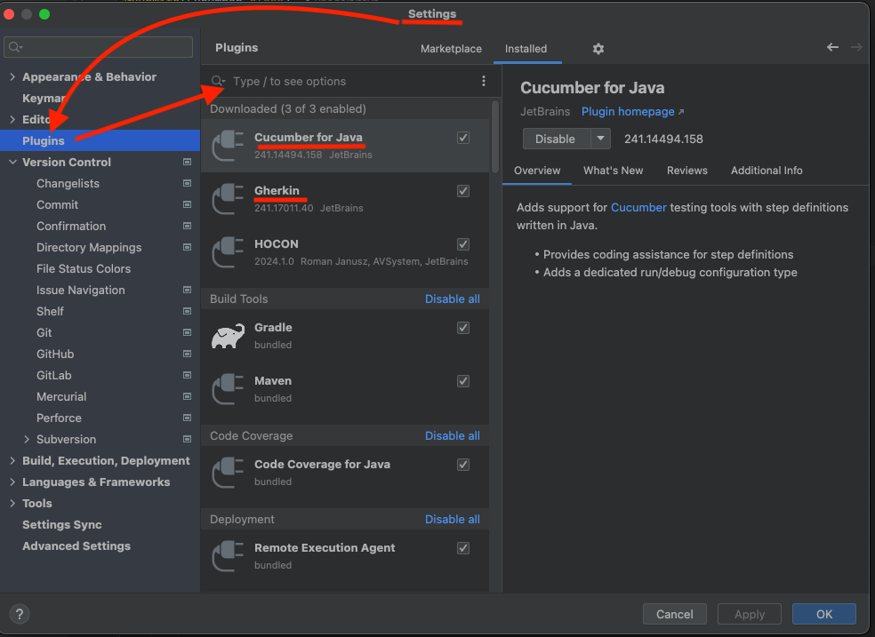

# Appium installation instruction for macOS users

1. homebrew
2. xcode
3. jdk
4. android sdk
5. avd
6. node and npm
7. appium

## 1. Homebrew

**homebrew** is a free and open-source software package management system that simplifies the installation of software on Apple's macOS operating system and Linux.

To install *homebrew* just run the following command via terminal prompt:

```	shell
$ /usr/bin/ruby -e "$(curl -fsSL https://raw.githubusercontent.com/Homebrew/install/master/install)"

```

Something similar should be printed out at the end of installation:

```shell
==> Installation successful!

==> Homebrew has enabled anonymous aggregate formulae and cask analytics.
Read the analytics documentation (and how to opt-out) here:
  https://docs.brew.sh/Analytics

==> Homebrew is run entirely by unpaid volunteers. Please consider donating:
  https://github.com/Homebrew/brew#donations
==> Next steps:
- Run `brew help` to get started
- Further documentation: 
    https://docs.brew.sh
   
```

Double check installation:

```shell
$ brew --version
```

Terminal has to respond with:

```bash
Homebrew ~your-homebrew-version~
Homebrew/homebrew-core (git revision xxxx; last commit xxxx)
```

## 2. Xcode

**xcode** is an integrated development environment for macOS containing a suite of software development tools developed by Apple for developing software for macOS, iOS, iPadOS, watchOS, and tvOS.

To get *Xcode*, open *App Store*, look for *Xcode*, hit *GET* (check out the screenshot below). I have it already installed, so there is *OPEN* instead of *GET*.


Follow installation instructions, you should be able to open *Xcode* at after the process:


To launch the iOS simulator, go to Xcode -> Open Developer Tool -> Simulator.


To launch a specific iOS simulator, go to Simulator -> File -> Open Simulator.


Command to get UDID:

```shell
$ xcrun simctl list
```


## 3. JDK

The **Java Development Kit** is an implementation of either one of the Java Platform, Standard Edition, Java Platform, Enterprise Edition, or Java Platform, Micro Edition platforms released by Oracle Corporation in the form of a binary product aimed at Java developers on Solaris, Linux, macOS or Windows.

Hopefully, you have already installed JDK, open the terminal and run the command:

```shell
$ java --version
```

You should get something similar to:

```bash
openjdk 11.0.17 2022-10-18 LTS
OpenJDK Runtime Environment Corretto-11.0.17.8.1 (build 11.0.17+8-LTS)
OpenJDK 64-Bit Server VM Corretto-11.0.17.8.1 (build 11.0.17+8-LTS, mixed mode)
```

Otherwise, proceed to this [page](https://www.oracle.com/technetwork/java/javase/downloads/jdk8-downloads-2133151.html) and look for a *Mac OS X* distribution, don't forget to accept license agreement! Follow instalation instructions and get `java —version` going. 

## 4. Android SDK

Download Android Studio from [here](https://developer.android.com/studio?pkg=studio), might take a while, installer quite bulky. Open installer and follow instalation instructions. 

## 5. AVD

Open **Android Studio** click on *Configure* and select *AVD Manager*:


Click at *+* icon:


Go with *Pixel 4* (for example) and hit *Next*:


Download Android *14.0* os image by clicking at *Download* link and following installation instructions:


Now it's a time to create an emulator, select Android *14.0* os image and hit next:

Rename AND so the name doesn't contain spaces (Pixel_4) and click *Next*:


Run emulator by clicking play button:


## 6. node.js and npm

**node.js** is an open-source, cross-platform JavaScript run-time environment that executes JavaScript code outside of a browser.

**npm** is a package manager for the JavaScript programming language. It is the default package manager for the JavaScript runtime environment Node.js. It consists of a command line client, also called npm, and an online database of public and paid-for private packages, called the npm registry.

That's a perfect time to try out previously installed **homebrew**:

```shell
$ brew install node
```

Verify instalation with `node -v` and `npm -v`.

```shell
$ node -v
v22.2.0
$ npm -v
10.8.0
```

## 7. Appium

**appium** is an open source test automation framework for use with native, [hybrid](http://appium.io/docs/en/writing-running-appium/web/hybrid/) and mobile web apps. It drives iOS, Android, and Windows apps using the WebDriver protocol.

Most probably you won't have writing permissions to `/usr/local/lib/node_modules` (place where npm will attempt to install appium). To fix that you need to figure out name of the current user: 

```shell
$ whoami
```

For instance:

```shell
$ whoami
somedude
```

To allow for current user to write to `/usr/local/lib/node_modules`  run the command:

```shell
$ sudo chown -R {current-user-name}: /usr/local/lib/node_modules
```

For instance to add writing permissions for our imaginary user, command will look like: 

```shell
$ sudo chown -R somedude: /usr/local/lib/node_modules
```

Now you can run the **npm** command to install **appium 2.0**:

```shell
$ npm install -g appium@next
```

Check Appium server version

```shell
$ appium -v
```

Check the installation location of the Appium server

```shell
$ where appium
```

Start Appium server manually. Open a terminal and enter:

```shell
$ appium
```

Stop Appium server manually:

```shell
$ control + C
```

Install the UiAutomator2 driver, which we are going to use to automate Android applications.

```shell
$ appium driver install uiautomator2
```

Install the XCUITest driver, which we are going to use to automate iOS applications.

```shell
$ appium driver install xcuitest
```

To ensure proper **appium** setup let's install **appium-doctor**

```shell
$ npm install appium-doctor -g
```

And execute setup verification with:

```shell
$ appium-doctor
...
WARN AppiumDoctor ✖ ANDROID_HOME is NOT set!
WARN AppiumDoctor ✖ JAVA_HOME is NOT set!
WARN AppiumDoctor  ✖ Carthage was NOT found!
...
```

At this point **appium-doctor** will complain about *ANDROID_HOME*, *JAVA_HOME* environment variables and *Carthage*, let's fix environment variables first. 

The first thing we need to make sure is that we are on the home path:

```shell
$ cd ~/
```
To verify that the .zshrc file already exists, run the following command:

```shell
$ ls -a
```


it should exist by default in the latest versions of Mac.

Just in case it doesn't exist, we can create it by running this command:

```shell
$ touch .zshrc
```

Open zshrc file:

```shell
$ open -e .zshrc
```

To configure $JAVA_HOME

Copy these two lines to .zshrc file

```shell
export JAVA_HOME=$(/usr/libexec/java_home)
export PATH="${JAVA_HOME}/bin:${PATH}"
```
Save the .zshrc file `Command+S`

Close the .zshrc file.

Now go to terminal and run this command:

```shell
$ source .zshrc
```

It is very **IMPORTANT** - if we do not use the source, in this case the setting of the environment variable will be temporary and the moment we close the terminal and start it again, the changes will be lost.

To check if $JAVA_HOME is set correctly, we can run this command:

```shell
$ echo $JAVA_HOME
```


To configure $ANDROID_HOME

Copy these two lines to .zshrc file

```shell
export ANDROID_HOME=${HOME}/Library/Android/sdk
export PATH="${ANDROID_HOME}/platform-tools:${ANDROID_HOME}/cmdline-tools:${PATH}"
```

Since we have already set the path for Java, we must combine both paths for Java and for Android.

```shell
export PATH="${ANDROID_HOME}/platform-tools:${ANDROID_HOME}/cmdline-tools:${JAVA_HOME}/bin:${PATH}"
```

Save the .zshrc file `Command+S`

Close the .zshrc file.

Now go to terminal and run this command:

```shell
$ source .zshrc
```

It is very **IMPORTANT** - if we do not use the source, in this case the setting of the environment variable will be temporary and the moment we close the terminal and start it again, the changes will be lost.

To check if $ANDROID_HOME is set correctly, we can run this command:

```shell
$ echo $ANDROID_HOME
```


Also we need to install Maven and configure M2_HOME variable. [Here](https://help.salesforce.com/s/articleView?id=001115431&type=1) are detailed instructions

This is what the .zshrc file looks like on my laptop


Install **carthage** using *homebrew*:

```shell
$ brew install carthage
```

## 7. Appium Inspector

You can install from [here](https://github.com/appium/appium-inspector/releases) -> Appium-Inspector-2024.6.1-mac-arm64.dmg


or:

```shell
$ brew install --cask appium-inspector
```

Run `appium-doctor` again, everything should be green now.

After you open the inspector, please check:

```shell
Remote Host - 127.0.0.1
Remote Path - do not need anymore
Remote Port - 4723
```


In order to create a connection between the inspector and the enameled device, you need to configure "Desired Capabilities"

For Android:

```shell
"platformName": "android",
"platformVersion": "14.0",
"deviceName": "Pixel_4",
"automationName": "UiAutomator2",
"app": "/Users/vpodoinitsyn/IdeaProjects/Drone-Native-Apps-Automation/src/test/resources/apps/app.apk"
```

For iOS:

```shell
"platformName": "iOS",
"appium:deviceName": "iPhone 14 Pro Max",
"appium:automationName": "XCUITest",
"appium:app": "/Users/vpodoinitsyn/IdeaProjects/Drone-Native-Apps-Automation/src/test/resources/apps/Dronemobile.app",
"appium:udid": "D3D4E299-20C5-4B60-8E81-BEA95C654EAB"
```


Do not forget to specify the path to the Drone apk file


*


To create a connection between the Appium server and the emulated device:
1. Start Appium server manually via terminal + Launch the emulator.
2. Click Start Session.


Open the required screen on the emulator and: 
1. Click the "Refresh" button in the Appium Inspector.
2. Click on the web element for which you want to find a locator (in this case the "Register" button)
3. Copy the selector (for example id)
4. To make sure this locator is working, click the magnify icon.


On the “Search for element” screen, select the id in this case and paste the selector copied on the previous page.



Then an element (or elements) will appear, select it and clicks in this case the "Tap Element" button.


In this case, the locator was selected correctly since the emulator opened the "Register" screen.


And also need to install the Cucumber for Java and Gherkin plugins in IntelliJ IDEA.

Go to IntelliJ IDEA -> Settings.


Settings -> Plugins and install.

